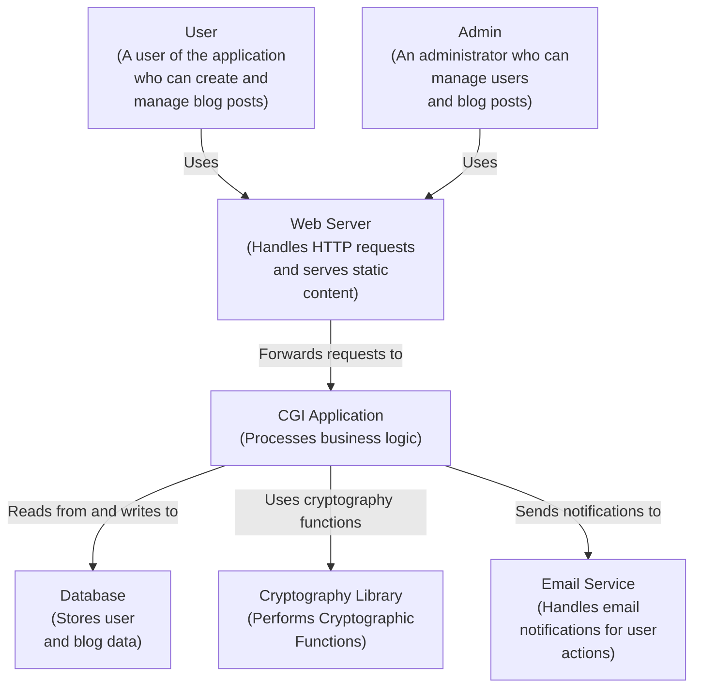

# DONT README

DON'T README is a pretty average and boring blogging site, your usual stuff. But, it was a nice chance to explore what goes into making a web framework, and the security aspects as well.

## Features

- Creating blogs
- Searching for blogs with HTMX
- Editting blogs
- Creating users as Admin Only
- Highly secure Auth Tokens
- Login with MFA2 (Email, and Authentication App)
- CSRF protection
- Sliding expiration session

## High-level Blog Architecture

## Used Libraries

- CryptoPP
    - https://github.com/weidai11/cryptopp
- Libcurl
    - sudo apt-get install libcurl4-openssl-dev

- Maria DB 
    - https://mariadb.com/docs/server/connect/programming-languages/cpp/install/

