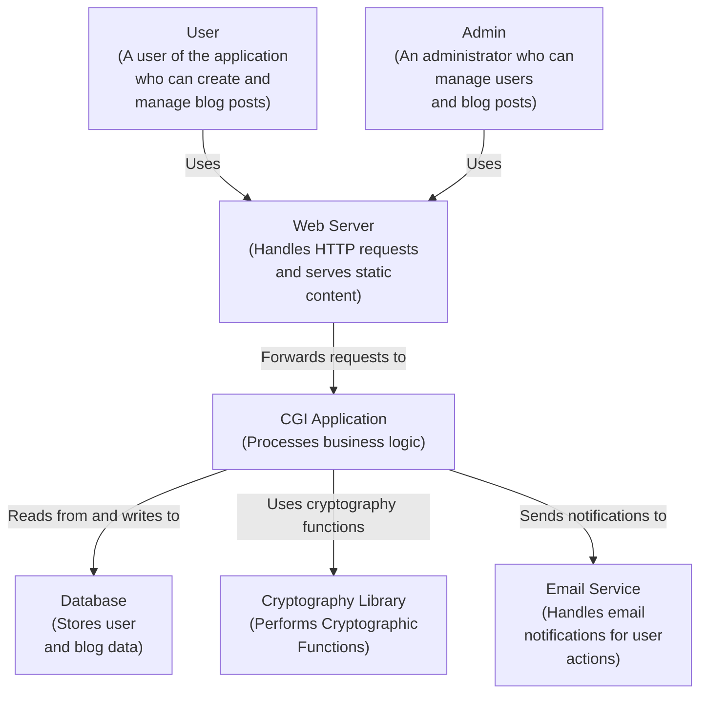
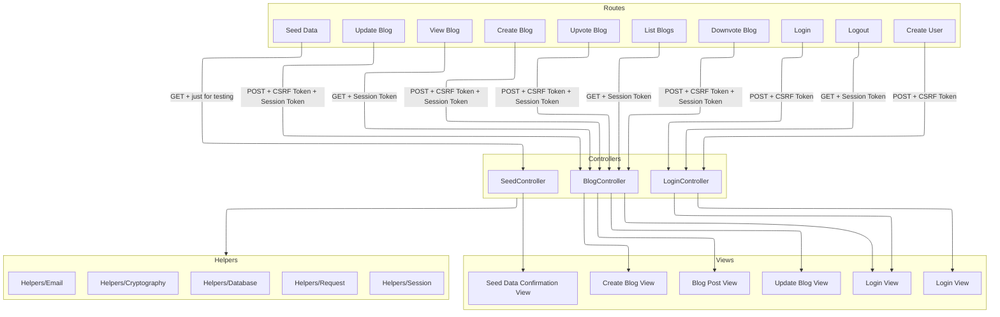

# README

## Features

- Creating blogs
- Searching for blogs
- Editting blogs
- Creating users as Admin
- Highly secure
- Login with MFA2 (Email, and Authentication App)
- CSRF protection
- Sliding expiration session

## High-level Blog Architecture

## Routing and Controllers

## Used Libraries

- https://github.com/weidai11/cryptopp
- sudo apt-get install libcurl4-openssl-dev
- sudo bash < <(curl -sL https://raw.githubusercontent.com/axllent/mailpit/develop/install.sh)
- https://mariadb.com/docs/server/connect/programming-languages/cpp/install/

